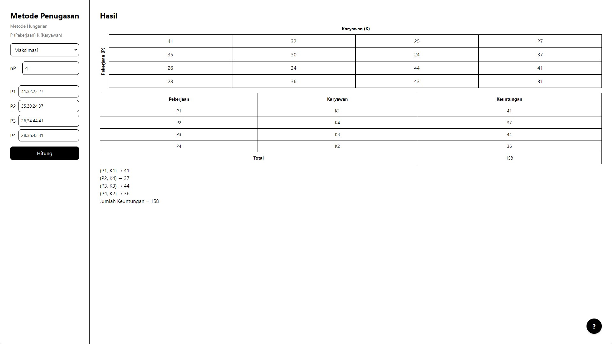

## Overview

Link aplikasi: [`https://metode-hungarian-client.netlify.app/`](https://metode-hungarian-client.netlify.app/). Untuk cara penggunaan dapat dilihat dengan cara meng-click tanda (**?**) pada pojok kanan bawah website.

> _Metode Hungarian adalah salah satu algoritma yang digunakan untuk menyelesaikan persoalan masalah assignment (penugasan), metode ini ditemukan dan dipublikasikan oleh Harold Kuhn pada tahun 1955. Algoritma Hungarian mempunyai dua solusi yaitu solusi minimal dan solusi maksimal._

Aplikasi ini dibuat untuk menghitung biaya total minimal atau waktu yang diperlukan untuk mengerjakan beberapa tugas (kasus minimasi). Dan dapat juga digunakan untuk menghitung hasil yang maksimal, misalnya hasil produksi dan keuntungan (kasus maksimasi).

Aplikasi ini dibuat dengan bahasa pemrograman Python sebagai server dan Javascript sebagai client. Library yang digunakan adalah:

Flask, Flask_cors, dan Munkres (Python)

React + Vite + Tailwind (Javascript).

## Contoh Data

Berikut adalah data yang dapat digunakan sebagai contoh: [Data Studi Kasus](client/data-studi-kasus.txt)
